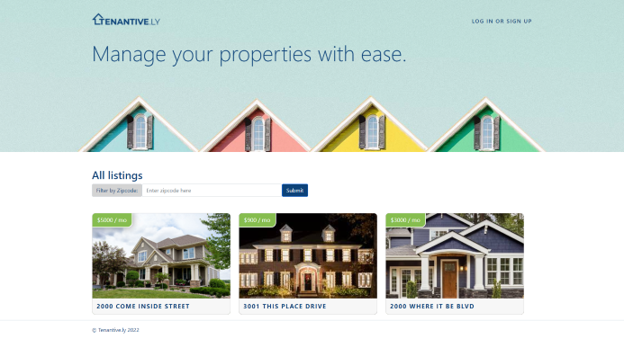

# tenantively-maybe-probably

## Description

Tenantive.ly allows landlords to create an account and list their properties. Users can create new properties, manage them with full CRUD, and enjoy a fully responsive mobile-first design that demonstrates a perfect balance of visual appeal and functionality.

The application utilizes handlebars.js for the front-end, rendering pages quickly and dynamically. There is a homepage, which lists all of the properties in order of when they were last updated. If a visitor clicks on one of the properties, they are taken to a page with more details about the property.

For landlords, there is a login/sign-up option that allows them to create an account. The account requires a unique email, a username, phone number, and password. Once signed up or logged in, you are automatically send to the homepage, where you will have access to the dashboard. The dashboard is where you can view your current properties, update them, or create new property listings. You can even add images to properties using the update form, with the images being stored in an AWS s3 Bucket after going through multer.

The front-end design features plenty of custom design, but the foundation is Bootstrap. JavaScript is also used to interact with the front-end and provide functionality to the pages.

For the back-end, the database is mysql2 powered by sequelize. The models used include a User model, Property model, and Amenities Model. Additionally, bcrypt is used for hashing the passwords, and express-session is used to store session data.

If you want to see the app in action, check out the [Demonstration Video](https://drive.google.com/file/d/152aV2i0jAbn25eMDTTpNjaJFQUP9xbjP/view)!

## Table of Contents

- [Installation](#installation)
- [Usage](#usage)
- [License](#license)
- [Contributing](#contributing)
- [Questions](#questions)
  

## Installation

If you wish to install the app locally, all you need to do is copy the repository and install the node packages. Additionally, you will need to set up a .env file and link a mysql database and AWS s3 Bucket with public read access and a user who can delete and add objects to the bucket.

## Usage

Once you have everything properly installed, you can easily run it using npm start, which will allow the server to be accessed at: localhost:3001

Additionally, you can use it without installing the code locally by going to the [Tenantive.ly Heroku Page](https://glacial-temple-16968.herokuapp.com/).

## License

This project is covered under the following license:

[MIT](https://www.mit.edu/~amini/LICENSE.md)

## Contributing

The project is not accepting any contributions at this time.

## Questions

If you have any questions, you can contact those involved through their GitHub accounts. Thanks!

[Spencer Hulse's GitHub](https://github.com/SpencerHulse)

[Benjamin Molini Vilhunen's GitHub](https://github.com/D1sl)

[Chris Hailey's GitHub](https://github.com/chrisphailey)
